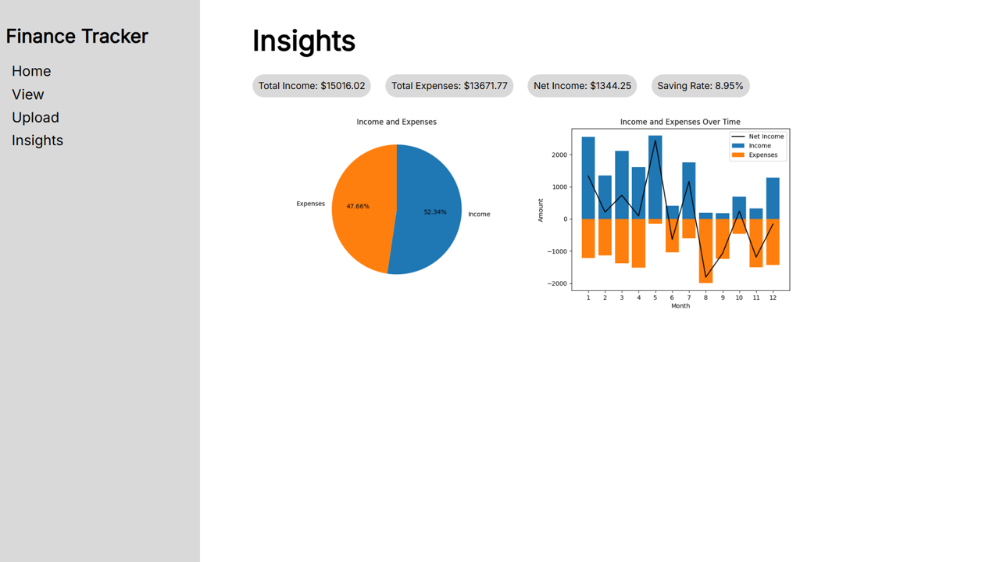

# Finance-Tracker

A Flask web application with a PostgreSQL database to track and monitor financial transactions.

## Table of Contents
- [Motivation and Outcomes](#motivation-and-outcomes)
- [Technologies](#technologies)
- [Installation](#installation)
- [Features](#features)
  - [Home](#home)
  - [View](#view)
  - [Upload](#upload)
  - [Insights](#insights)

## Motivation and Outcomes
I wanted to consolidate all my financial transactions into a single place to better manage my own finances.
I created a Flask web application to perform CRUD operations to store and manage my financial transactions to be stored in a PostgreSQL database.
I was able to create and connect my interactive Power BI report to the database to gain additional insights to my financial transactions.
You can view a PDF version of the Power BI report here: [PDF Power BI Report](media/Finance%20Tracker%20Power%20BI%20Report.pdf)

## Technologies
This project was created with:
- Python
- Flask
- pandas
- matplotlib
- PostgreSQL
- Microsoft Azure
- Power BI Desktop

## Installation
1. Clone the repository
```
$ git clone https://github.com/Lin-Ian/Finance-Tracker.git
```
2. Install Requirements
```
pip install -r requirements.txt
```
3. Set up the PostgreSQL Database and .env file for the application
```
DB_HOST=database_host
DB_NAME=database_name
DB_USERNAME=database_username
DB_PASSWORD=database_password
```
4. Set up the Database Tables
```
py init_db.py
```
5. Run the application
```
py app.py
```
Open the localhost link, and you're ready to start tracking your transactions now

## Features
### Home
- Enter transactions to be stored in database
- Store important data like the date, vendor, category, amount, and any notes about your transaction


### View
- View entered transactions
- Sort by default, date, or amount
- Filter transactions based on date, category, vendor, and/or amount
- Save your (filtered) transactions as a CSV file
- Update or delete any transactions


### Upload
- Upload transactions stored in a CSV file if there are too many to enter one at a time


### Insights
- Gain more insights about your transactions
- See your total income and expenses, net income, and savings rate
- Intuitive visuals to view your income and expenses


